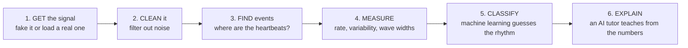
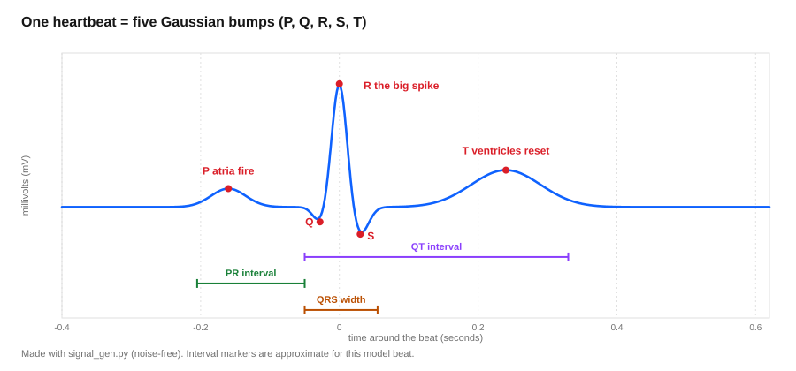
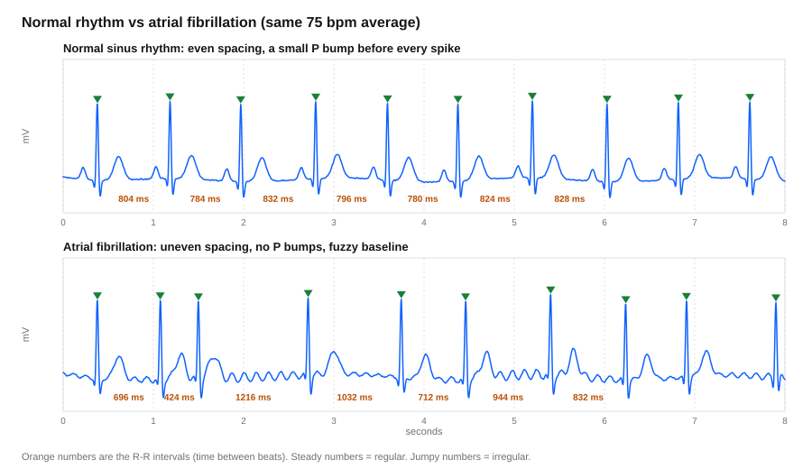
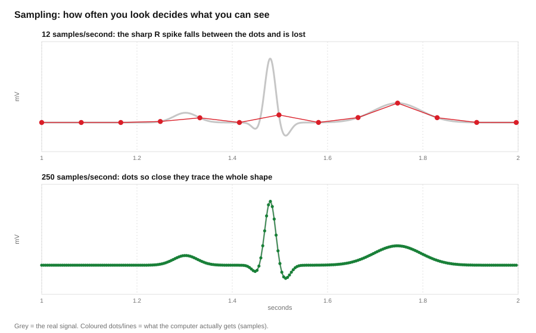
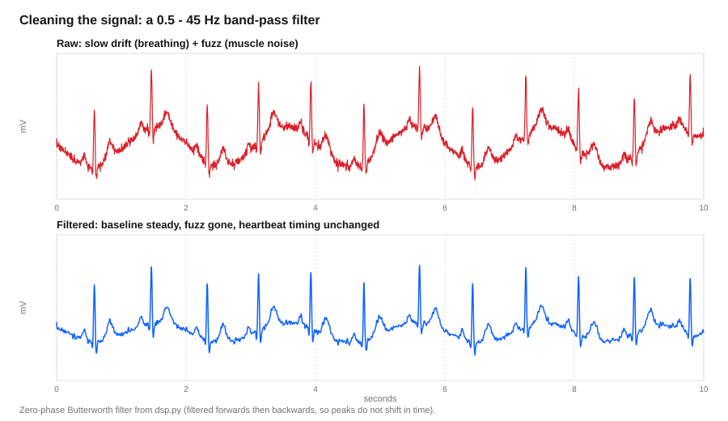
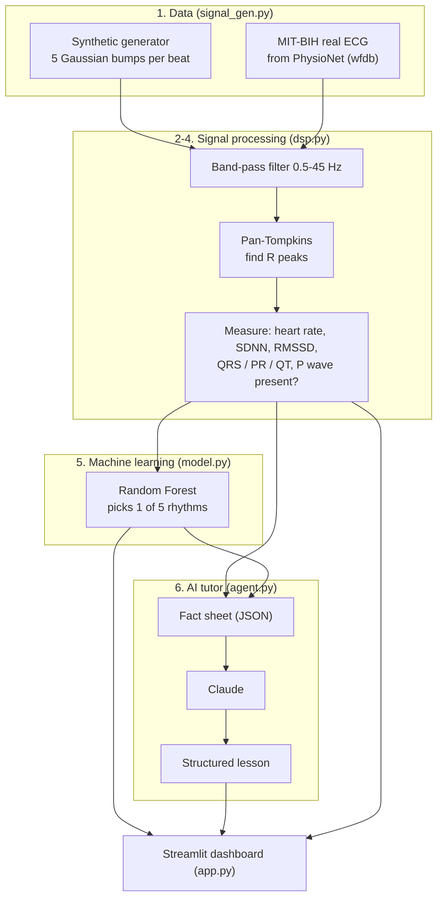
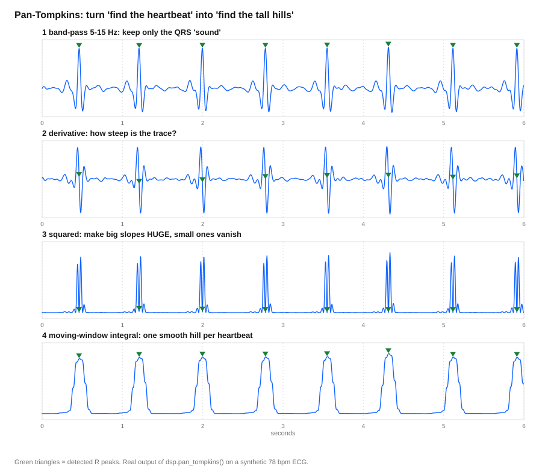
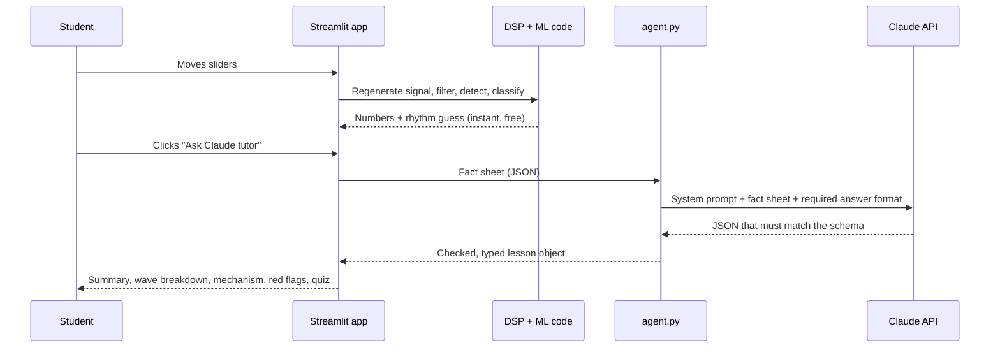

# CardioCore AI: A Student's Guide to Time-Series Data

> **Who this is for:** you know a little Python (or none), you have never worked with time-series
> data, and you have never read an EKG. By the end you will know what this app does, why each tool
> is in it, and how a real heart monitor differs from it.
>
> **Reading time:** about 30 minutes. **Hands-on labs:** about 45 minutes.
>
> **Important:** this is a teaching simulation, **not a medical device**. Never use it to judge a real person's health.

---

## Contents

1. [The big idea in one minute](#1-the-big-idea-in-one-minute)
2. [EKG fundamentals in five minutes](#2-ekg-fundamentals-in-five-minutes)
3. [What is time-series data? The things you must get right](#3-what-is-time-series-data-the-things-you-must-get-right)
4. [How the app works, step by step (and the tools we chose)](#4-how-the-app-works-step-by-step)
5. [The AI agent workflow](#5-the-ai-agent-workflow)
6. [Real EKG devices: how live, never-ending data changes everything](#6-real-ekg-devices-how-live-never-ending-data-changes-everything)
7. [Hands-on labs](#7-hands-on-labs) (including "how does AFib work?")
8. [Mistakes we actually made (so you don't have to)](#8-mistakes-we-actually-made)
9. [Glossary and further reading](#9-glossary-and-further-reading)

---

## 1. The big idea in one minute

A heart is an electrical machine. Stick two sticky pads on a chest and you can record a wobbly
line of voltage over time. That wobbly line is a **time series**: numbers in the order they
happened. This app takes that line and does six jobs, the same six jobs almost every time-series
project has:



**Analogy: a kitchen.** Getting the signal is *buying groceries*. Cleaning is *washing the
vegetables*. Finding events is *chopping*. Measuring is *weighing the portions*. Classifying is
*tasting and naming the dish*. Explaining is *the chef telling you why it works*. Skip washing, and
the best chef in the world still serves you dirt.

---

## 2. EKG fundamentals in five minutes

**EKG** (or **ECG**) means *electrocardiogram*: a recording of the heart's electrical activity.

### The heart in one paragraph

The heart has four rooms: two small **atria** on top, two big **ventricles** below. Every beat, a
tiny natural pacemaker (the **SA node**) fires. The signal spreads across the atria (they squeeze
and push blood down a little), waits a moment at a gate (the **AV node**), and then races through
the ventricles (they squeeze hard and push blood to the lungs and body). Then everything
electrically resets, ready for the next beat.

**Analogy: a relay race with a starting pistol.** The pacemaker fires the pistol. The atria run the
first short leg. There is a brief handover pause at the AV node. Then the ventricles sprint the big
leg. Then everyone walks back to the start line. One lap = one heartbeat.

### What each bump on the line means



| Wave | What is happening | Analogy |
|---|---|---|
| **P** | Atria fire (small, slow bump) | The starting pistol, quiet |
| **PR interval** | Signal pauses at the AV node | The baton handover |
| **Q, R, S** ("the QRS complex") | Ventricles fire: the **tall narrow spike** | The big drum hit |
| **T** | Ventricles electrically reset | Catching your breath |
| **QT interval** | Whole fire-and-reset of the ventricles | One full "drum hit + recovery" |

Two everyday numbers come straight from this picture:

- **R-R interval**: time from one R spike to the next. **Heart rate (bpm) = 60 ÷ R-R in seconds.**
  R-R of 0.8 s means 75 beats per minute.
- **Regularity**: are the R-R gaps all about the same, or do they jump around?

### The rhythms this app knows

| Rhythm | In plain words | What you see on the line |
|---|---|---|
| **Normal sinus rhythm (NSR)** | Healthy, pacemaker in charge | Even spacing, a P bump before every spike, 60-100 bpm |
| **Sinus bradycardia** | Same rhythm, but slow | Everything normal, under 60 bpm |
| **Sinus tachycardia** | Same rhythm, but fast | Everything normal, over 100 bpm |
| **Atrial fibrillation (AFib)** | The atria quiver chaotically instead of squeezing in an organised way | Uneven spacing ("irregularly irregular"), **no P bumps**, a fuzzy baseline |
| **PVC** (premature ventricular contraction) | A ventricle fires *early*, on its own | An early, **wide, tall, odd-shaped** beat followed by a longer pause |

**AFib analogy: a drum circle where the conductor left.** Normal rhythm is a metronome: tick,
tick, tick. In AFib the drummers each hit whenever they like, and the ventricles only sometimes
answer, at random moments. You can't predict the next beat, and you never see the clean "P" starting pistol.

**PVC analogy: a hiccup.** The beat arrives too early (that is the "premature" part), it looks
different because it started in the wrong place, and then the heart pauses to get back on schedule.



*Real output from this app's generator. Top: R-R gaps are almost identical (about 800 ms). Bottom:
gaps of 696, 424, 1216, 1032 ms. Same average heart rate, completely different rhythm.*

---

## 3. What is time-series data? The things you must get right

A **time series** is a list of measurements *in time order*. Stock prices, temperature logs,
phone step counts, server CPU usage, and heartbeats are all time series. The order is the whole
point: shuffle the numbers and the story is gone.

Time-series data has traps that ordinary spreadsheets don't. Here is the checklist we followed.

### 3.1 Know your clock: sampling rate

A computer can't record a smooth curve, so it **samples**: it looks at the voltage every
so often and writes the number down. The **sampling rate** (Fs) is how many looks per second, in
**hertz (Hz)**. This app uses 250 or 500 Hz for synthetic data and 360 Hz for the real MIT-BIH data.

**Analogy: a flip-book.** Few drawings per second and the motion looks jumpy, and quick actions
vanish. More drawings per second and the motion looks smooth.



*Top: 12 samples per second. The sharp R spike falls in the gap between two dots, so the computer never sees it. Bottom: 250 per second: the shape is captured.*

**The Nyquist rule** says: to capture a wave of frequency *f* you must sample at **more than 2 × f**.
The highest frequency you can hold, Fs ÷ 2, is called the **Nyquist frequency**. At 250 Hz that's
125 Hz, far above the ~45 Hz of useful ECG content, so we are safe. Break the rule and you get
**aliasing**: fast things pretend to be slow things.

**Analogy: the wagon-wheel effect.** In old films, a fast-spinning wheel can look like it spins
slowly backwards. The camera (24 frames per second) isn't looking often enough.

### 3.2 Noise and artifacts are always there

Real signals are dirty. In an EKG the usual culprits are:

| Nuisance | Where it comes from | Looks like |
|---|---|---|
| **Baseline wander** | Breathing, sweat, electrodes moving | A slow up-and-down drift (below ~0.5 Hz) |
| **Muscle noise (EMG)** | Shivering, flexing your arm | Fast fuzz (above ~45 Hz) |
| **Mains hum** | Wall power (50/60 Hz) | A steady fine buzz |
| **Motion artifact** | Walking, a loose pad | Big random jumps |

### 3.3 Filtering, and how it can fool you

A **filter** removes some frequencies and keeps others.



We use a **band-pass filter from 0.5 to 45 Hz**: keep the middle, throw away the slow drift and the fast fuzz.

**Analogy: measuring ocean waves from a boat.** The tide is a very slow rise and fall: not what
you care about, so remove it (that's the 0.5 Hz "high-pass" edge). Spray and ripples are tiny,
fast jiggles: also not interesting, so remove those (the 45 Hz "low-pass" edge). The waves
you came to measure are in the middle.

Two filtering gotchas that catch everyone:

1. **Filters can shift things in time.** A normal filter delays some frequencies more than others,
   which smears the timing of your spikes. We use a **zero-phase** filter (run it forward, then
   backward) so R peaks stay exactly where they were. *Catch:* it needs the whole recording, so it
   can't be used on a live stream (more in section 6).
2. **Filters misbehave at the edges** of a recording, because they need "future" and "past"
   data that isn't there. Never trust the first and last moments of a filtered window.

### 3.4 Windows

We look at **windows** (10 to 30 seconds) of the never-ending signal, like reading a book through
a small cut-out. The window length is a trade-off: short = quick answers but shaky statistics; long
= stable statistics but slow. Some measurements *need* length: the "LF/HF" heart-variability
ratio in this app shows n/a below 20 seconds because a 0.04 Hz rhythm takes at least 25 s to complete one cycle.

### 3.5 Find the events first, then measure

An EKG is mostly boring baseline with occasional important events (the heartbeats). Before you can
measure anything you need to **find** them. This is called **segmentation** or **event detection**.

### 3.6 Test the way you will really be used

The most common way beginners fool themselves in machine learning:

- **Random split trap.** Neighbouring windows from the same person look almost identical. If you
  randomly split windows into "train" and "test", the test set contains near-copies of the training
  set, and the score looks amazing. Real projects split **by person (or by recording)**.
- **Accuracy is not enough.** If 99% of the time the heart is fine, a model that always says "fine"
  is 99% accurate and useless. Use **sensitivity** (of the real events, how many did we catch?) and
  **PPV / precision** (of the alarms we raised, how many were real?).
- **Fake data flatters you.** Our classifier scores **100%** on synthetic test data. On real patient
  recordings it is right on 11 of 12 slices we tried. Same model, real world: humbling. This is called
  **distribution shift** or the "domain gap", and you can see it live in the app (Lab 6).

### 3.7 Labels have context

Sometimes the "right answer" for a moment depends on what came *before* it. In real hospital
recordings, a doctor marks *"AFib starts here"* once, and every second after belongs to AFib until
the next marker. If you cut out a 10-second slice from the middle, it contains **no marker at all**.
We hit exactly this bug (section 8).

### 3.8 The checklist

| ☐ | Ask yourself |
|---|---|
| ☐ | What is my sampling rate, and is it above 2× the fastest thing I care about? |
| ☐ | Are timestamps regular? What if samples are missing? |
| ☐ | What noise is in this signal, and did my filter change anything else? |
| ☐ | Do my window edges give false results? |
| ☐ | Did I find the events before I measured them? |
| ☐ | Am I testing on *different* people/recordings from the ones I trained on? |
| ☐ | Am I measuring sensitivity and precision, not just accuracy? |
| ☐ | Is my training data like the real world? Have I checked on real data? |
| ☐ | Do my labels depend on state that was cut off by windowing? |
| ☐ | Will this run *live*? Can it only use past data (no peeking at the future)? |

---

## 4. How the app works, step by step

Here is the whole app on one page:



### Tools used, and why

| Tool | What it does here | Why this one |
|---|---|---|
| **Python 3.12 + `uv`** | Language and package manager | Fast, reproducible installs (`uv sync`) |
| **NumPy** | Fast math on big arrays of samples | A signal *is* an array; NumPy is the foundation of scientific Python |
| **SciPy (`scipy.signal`)** | Butterworth filters, peak finding, spectrum | Battle-tested DSP routines: don't reinvent filters |
| **pandas** | Small tables in the UI | Convenient display of the feature table |
| **scikit-learn** | The Random Forest classifier | Small, fast, explainable machine learning for a few numbers |
| **wfdb** | Reads real recordings from PhysioNet | The standard library for that data format |
| **Streamlit** | The interactive web dashboard | Build a UI in pure Python; sliders re-run the analysis instantly |
| **Plotly** | Zoomable charts | Interactive time-series plots |
| **Anthropic SDK + Pydantic** | Talk to Claude and validate its answer | Typed, checked, structured responses |
| **python-dotenv** | Loads your API key from `.env` | Keeps secrets out of the code |
| **pytest** | 54 automated tests | Signal code fails silently, so tests are how you know it works |

### Step 1: Get the signal (`signal_gen.py`)

**Synthetic mode.** Each heartbeat is built from five smooth bumps, one for each of P, Q, R, S, T. A
smooth bump is a **Gaussian**: `A · exp(−(t−μ)² / 2σ²)`, where `A` is height, `μ` is where it
sits, and `σ` is how wide it is. Add the five up and you get a heartbeat. Repeat every R-R seconds
and you have an EKG.

**Analogy: building a mountain range from five hills.** Tall skinny hill = R. Small wide hill = P. Medium hill later = T. Two little dips = Q and S.

Then we **change the recipe to make diseases**:
- **AFib:** random R-R gaps, delete the P hill, add a tiny fast ripple.
- **PVC:** an early beat with a *much wider, taller* R hill and no P hill, followed by a pause.
- **Noise:** add random fuzz at a chosen **signal-to-noise ratio (SNR)**: 30 dB is clean, 5 dB is a mess.

**Real mode.** Loads a few seconds of a real patient recording from the **MIT-BIH Arrhythmia
Database** (a famous, freely available research dataset, recorded at 360 Hz). Real recordings also
come with the cardiologists' beat-by-beat annotations, which we use as an answer key.

### Step 2: Clean it (`dsp.py`, `bandpass`)

The band-pass filter from section 3.3. In the app, switch on the **Raw** checkbox under the chart:
the grey line is the raw signal, the blue line is the filtered one.

### Step 3: Find the heartbeats (`dsp.py`, `pan_tompkins`)

The **Pan-Tompkins algorithm** (1985!) is a classic, still-taught recipe. Its trick: turn "find the
heartbeat" into "find the tall hills" in four moves.



1. **Band-pass 5-15 Hz.** Keep only the "sound" the QRS makes.
2. **Derivative.** Measure how *steep* the line is. The QRS is the steepest thing in an EKG.
3. **Square it.** Big slopes become HUGE, small wiggles become nothing.
4. **Moving-window integral.** Smear it into one smooth hill per beat.

Then an **adaptive threshold** decides which hills are real beats.

**Analogy: a bouncer who adjusts to the crowd.** In a quiet bar he only lets in clearly tall guests; if the crowd gets rowdy he raises the bar so he doesn't admit troublemakers. The threshold *adapts* to the noise level. There's also a **200 ms refractory rule**: after a beat, the heart physically cannot fire again for a moment, so nothing counts in that gap.

In the app, click **Pan-Tompkins stages** above the chart to see all four stages of *your* signal.

### Step 4: Measure (`dsp.py`, features)

From the R peaks and the waveform around them:

| Measure | Meaning | Analogy |
|---|---|---|
| **Heart rate** | 60 ÷ average R-R | Beats per minute |
| **SDNN** | Spread of all R-R intervals | How far off a metronome is *overall* |
| **RMSSD** | Beat-to-beat jumpiness | How much *each* tick differs from the last |
| **pNN50** | % of neighbouring gaps that differ > 50 ms | How often the drummer lurches |
| **QRS width** | How long the big spike lasts | A quick snare crack vs a slow thud |
| **PR / QT** | Interval estimates | Handover time / recovery time |
| **P wave present?** | Is there a bump before the spike? | Did the starting pistol fire? |

**Analogy: a metronome vs a jazz drummer.** A metronome has SDNN and RMSSD near zero. A jazz
drummer improvising has large values. AFib is the jazz drummer.

*Honesty note:* PR, QRS and QT here are simple estimates, so the tiles say **(est.)**. Professional software uses far more careful methods and many leads.

### Step 5: Classify (`model.py`)

A **Random Forest** looks at 11 numbers (heart rate, SDNN, RMSSD, QRS width, wide-beat fraction, P wave present, ...) and picks one of five rhythms.

**Analogy: a panel of 200 simple judges.** Each judge (a small decision tree) looks at only some
of the numbers and asks easy yes/no questions: *"Is heart rate over 100? Is there a P wave? Are
the gaps wildly uneven?"* Each votes. The share of votes is the **confidence** you see in the badge, like "AFIB (100%)".

Why not a giant neural network? With a handful of meaningful numbers, a forest is fast,
tiny, trains in a minute, and you can ask it *which numbers mattered* (the **ECG Physics** tab shows
this). Simple, explainable tools first.

**How it was trained:** on about 1,500 synthetic windows with random heart rates, noise levels and
rhythms, all run through the *same* filter and measurements the app uses live. It holds back
25% for an honest test.

### Step 6: Explain (`agent.py`)

That's the next section.

---

## 5. The AI agent workflow

### What the agent sees (and what it doesn't)

**The AI never looks at the waveform.** It gets a short **fact sheet** made by our own code. Here is a real example for an AFib window:

```json
{
  "heart_rate_bpm": 74,
  "mean_rr_ms": 811,
  "sdnn_ms": 178.6,
  "rmssd_ms": 230.7,
  "pnn50_percent": 80.0,
  "qrs_duration_ms": 92,
  "wide_qrs_beat_fraction": 0.0,
  "pr_interval_ms": null,
  "qt_interval_ms": 354,
  "p_wave_present": false,
  "ml_prediction": "Atrial Fibrillation",
  "ml_confidence": 1.0,
  "signal_source": "synthetic"
}
```

**Why?** Because each part of the system does what it is best at:

| Job | Best done by | Why |
|---|---|---|
| Measuring exact numbers from 2,500 samples | **Plain code** | Exact, free, repeatable, testable |
| Explaining what the numbers mean and teaching | **The language model** | Explaining and adapting to a student is what it's good at |

**Analogy: a doctor's assistant reading a lab report.** Lab machines measure blood exactly. The
assistant doesn't re-measure it; they read the *report* and explain it. Ask a language model to
"eyeball" 2,500 numbers and you'd get confident guesses. Give it a clean report and you get a helpful explanation.

### The round trip



### The pieces of the agent, in plain words

1. **System prompt = the job description.** "You are CardioCore Tutor, a friendly teaching assistant. Use only the fact sheet. Never invent measurements. This is a simulation, not medical advice. If the numbers don't match the classifier's label, say so and teach from it."
2. **The fact sheet = the case file** (above).
3. **Structured output = a form, not an essay.** We define the answer as a Python class, `EKGAnalysisResponse` (summary, wave breakdown, teaching concept, red flags, quiz with four options and a correct index). The API forces Claude's reply to fit that form, and Pydantic checks it. No parsing messy text.
4. **Guardrails.** Missing API key, wrong key, rate limits, no internet, a refusal, a cut-off answer: each becomes a friendly message in the panel. The app never crashes because the AI is unavailable.
5. **Cost control.** The AI only runs when you press the button, not on every slider tick. Results are remembered by a hash of the fact sheet, and if you change the signal the badge warns *"tutor lesson is from an earlier signal"*.

**Analogy: a form with tick-boxes.** Ask "how was your day?" and you get a paragraph.
Hand over a form with labelled boxes and every answer arrives in the same shape, ready for a
computer to use.

### Is this an "agent"?

Honest answer: it is the simplest useful kind. It has a role, context we inject, and a structured
output, but it makes **one call** and does not choose tools in a loop. That is deliberate, because
"the simplest thing that works" is a good rule. A more advanced agent could *decide* to ask for
more data (for example, "re-measure over a longer window") by calling tools. Once you understand this
version, that's the natural next step.

---

## 6. Real EKG devices: how live, never-ending data changes everything

This app works on **finished snippets**: a 10-second window that already exists. A bedside monitor
or wearable has a different problem: **the data never stops, and it must react now.**

**Analogy: editing a film vs live TV.** Editing lets you rewind, look ahead and fix mistakes. Live TV
shows the moment as it happens: you can't rewind, and a delay of 30 seconds is a failure.

### The live data path

```text
  electrodes     amplifier    ADC (sample)   small buffer      real-time DSP        decisions
  on the skin -> boosts tiny -> turns volts  -> of the most  -> causal filters  -> beat by beat
  (microvolts)   signal        into numbers    recent seconds   + beat detector     heart rate, alarms
      |                                          ^  ^  ^  ^                           |
      |         lead-off? noise? pad loose?      |  |  |  |  new samples slide in    v
      +--------------------------------------->  [ ring buffer ]                    display / alert /
                                                                                     store / send
```

### This app vs a real device

| Topic | This teaching app | Real bedside / wearable device |
|---|---|---|
| **Data** | A finished 10-30 s window | An endless stream, hours to days |
| **Processing** | Whole window at once | Small chunks as they arrive (a **ring buffer**: keep only the latest few seconds) |
| **Filters** | Zero-phase (looks at past *and* future) | **Causal**: may only use the past. Adds a little delay, and keeps its internal state between chunks |
| **Beat detection** | Runs once per window | Runs continuously, beat by beat, with thresholds that adapt over minutes |
| **Speed** | Seconds is fine | Milliseconds to seconds; a late alarm is a wrong alarm |
| **Leads** | One (Lead II-like) | Often 3, 5 or 12 leads, so problems can be located and noise cross-checked |
| **Bad contact** | Not modelled | **Lead-off detection**: is a pad loose or a wire disconnected? Show "check electrodes", don't report a heart rate of noise |
| **Mains hum** | Mostly filtered by the 45 Hz cut | Dedicated 50/60 Hz notch filtering and shielding |
| **Motion** | Not modelled | Walking, coughing and rolling over are the daily enemy, especially on wearables |
| **Data problems** | Never lost | Dropped packets, clock drift, timestamps that must line up, sensors that reboot |
| **Alarms** | None | Tuned very carefully. Too sensitive = constant false alarms and **alarm fatigue** (staff start ignoring them); too quiet = missed events |
| **Where AI runs** | Cloud LLM on a button press | Small models, often **on the device** (power, privacy, speed). Language models explain **after the fact**, not in the alarm loop |
| **Personalisation** | None | Compares against *this patient's own* baseline; a "normal" rate differs between an athlete and a grandparent |
| **Rules** | Educational demo | Regulated medical software: tested, documented and validated on many patients and conditions |
| **Power and storage** | Plugged in | Battery life, compression, what to keep and what to throw away |

### What carries over unchanged

The *ideas* are exactly the same: clean the signal, find the events, measure them, classify, explain.
Pan-Tompkins was designed for real-time use in the first place. What changes is the plumbing: chunks
instead of windows, past-only filters instead of zero-phase ones, and lots of defensive engineering around a messy world.

**One rule worth memorising:** *a language model may help explain a result, but it should never be
the thing deciding whether an alarm sounds.* Safety-critical decisions stay in fast, simple,
thoroughly tested code.

---

## 7. Hands-on labs

**Start the app:** `uv run streamlit run src/app.py` and open http://localhost:8501.

### A quick map of the screen

```text
+-------------------------------------------------------------------------------+
| CardioCore AI      [ ECG | Pan-Tompkins stages ]        [ Synthetic | MIT-BIH ]|
+-------------------------------------------------+-----------------------------+
|  CHART (blue = filtered, grey = raw,            | [ AFIB (100%) ]  <- verdict |
|         green triangles = detected R peaks)     |  Analysis | ECG Physics     |
|                                                 |  [Ask Claude tutor]         |
|  [x] Raw   [ ] True beats                       |   summary, waves, quiz ...  |
|  Heart rate | Signal-to-noise | Inject arrhythmia | More                      |
|  [ HR ] [ PR ] [ QRS ] [ QT ] [ SDNN ] [ RMSSD ]                              |
+-------------------------------------------------+-----------------------------+
```

### Lab 1: See a normal heart (5 min)

Leave everything on the defaults (72 bpm, 30 dB, *Normal sinus*).

- Look for the **green triangles**: evenly spaced.
- Look at each spike: a small **bump before it** (the P wave) and a broader bump after it (the T wave).
- Read the tiles: heart rate ≈ 72 bpm, QRS ≈ 92 ms, PR ≈ 168 ms, QT ≈ 366 ms, SDNN and RMSSD small (about 30 ms).
- The badge says **NSR**.

Now drag **Heart rate** to 45, then 150. The badge changes to **Sinus Bradycardia** and **Sinus Tachycardia**. The waveform shape stays normal: only the *speed* changed.

### Lab 2: How does AFib work? (10 min)

**The idea to test:** *"AFib = irregular timing + no P wave."* Let's prove both with the app.

1. Set **Heart rate** to about 75 and **Inject arrhythmia** to **Atrial fibrillation**.
2. **Look at the timing.** The green triangles are now unevenly spaced. Tick **True beats** to overlay orange circles showing where the beats *really* are: the detector should agree.
3. **Look for the P wave.** Before, each spike had a small bump. Now there's none, just a fuzzy, wobbly baseline (the atria quivering).
4. **Read the tiles.** **PR** shows **n/a** (there's no P wave to measure from). **SDNN** jumps to about 180 ms and **RMSSD** to about 230 ms, up from about 30. *The jazz drummer has entered.*
5. Open the **ECG Physics** tab. Find **R-R CV** (variability relative to the rate: high) and **P wave: absent**. The *Classifier vote share* chart shows **Atrial Fibrillation** with nearly all the votes.
6. Click **Ask Claude tutor**. Read the *Physiologic mechanism* and *Clinical red flags* sections, and check whether the numbers it cites match the tiles on screen. Answer the quiz at the bottom.

**What you just learned:** you can recognise a chaotic rhythm from two simple measurements (irregular R-R intervals, missing P waves). That is exactly how the Random Forest does it too.

### Lab 3: Break the detector with noise (5 min)

1. Go back to **Normal sinus**. Slowly drag **Signal-to-noise (dB)** from 30 down to 5.
2. Watch the grey *raw* line get fuzzy and the blue *filtered* line stay calmer.
3. Open **ECG Physics** and read the line *"Pan-Tompkins vs true beats: sensitivity … PPV …"*. At 30 dB it should be about 100%. Push it lower and watch it slip.
4. Find the point where the heart rate on the tile goes wrong. That is what "garbage in, garbage out" looks like.

**Lesson:** every number downstream depends on the beat detector, and the detector depends on signal quality. Noise is not a cosmetic problem.

### Lab 4: Look inside the detector (5 min)

Click **Pan-Tompkins stages** above the chart. Compare the four stacked plots to the diagram in section 4. See how the messy signal at the top becomes clean hills at the bottom. Now lower the SNR and watch the hills at the bottom: which stage fails first?

### Lab 5: Meet a PVC (5 min)

Choose **PVC (premature beats)**. Look for:
- A beat that arrives **early**, is **taller and wider**, and often points the *other way* afterwards.
- A **longer pause** after it (the heart catching up).
- The **QRS (est.)** tile still shows about 92 ms, because it is a *median* across all beats and most beats are normal. But **ECG Physics → Wide-QRS beats** jumps well above 0%. That row is where the PVCs show up.
- The badge switches to **PVC**.

Question: *why can't the classifier just use heart rate to spot a PVC?* (Answer: the average rate looks normal. It's the shape and timing of individual beats that give it away.)

### Lab 6: Real patients and the domain gap (10 min)

Switch **Data source** to **MIT-BIH (real)**. Now the signals are real people. Read the small line under the badge: **"annotated / true label"** is what cardiologists marked.

| Record (start 0 s) | What it is | What to notice |
|---|---|---|
| **100** | Mostly normal rhythm | The classifier may say **PVC at low confidence**. This slice has one early *atrial* beat (not ventricular) and our model has no class for that. |
| **119** | Frequent PVCs (bigeminy) | Correctly **PVC** |
| **201** | Atrial fibrillation | Correctly **AFib**. Try **Start (s)** = 60 and 120: still AFib. |
| **208** | Very frequent PVCs | **PVC** (early versions of this model called it AFib!) |

Questions:
1. Where does the app say **"Domain gap"**? What does it mean?
2. Our model scored 100% on synthetic tests. Why isn't it 100% here?
3. What extra class would fix record 100? (Answer: premature *atrial* contractions.)

### Challenge questions

1. Sampling rate is 250 Hz. What is the fastest frequency the data can represent? (125 Hz)
2. R-R = 600 ms. Heart rate? (100 bpm)
3. Why do we use zero-phase filtering here but couldn't in a bedside monitor?
4. If a monitor's beat detector missed 1 in 10 beats, what would happen to the heart rate it shows?
5. Why does the AI tutor get a fact sheet instead of the waveform?
6. Why is "100% test accuracy" on synthetic data almost meaningless?

---

## 8. Mistakes we actually made

This project hit real time-series problems while being built. They are the best lessons in this guide.

| What happened | Lesson |
|---|---|
| **The model scored 100% on test data, then failed on real recordings.** | Synthetic data only teaches the model what the *simulation* looks like. Always test on real data. |
| **Record 208 (lots of PVCs) was called AFib.** The synthetic training data only had *occasional* PVCs, and the model had learned the shortcut *"no P wave + irregular = AFib"*. | Models learn shortcuts. Make training data cover the real variety, then check the *reason* it decides. Fix: train with PVC-heavy rhythms and weak/hidden P waves. |
| **Real AFib slices were labelled "Normal" by our own loader.** Cardiologists mark "AFib starts here" once. A slice cut from the middle contained no marker, so the code assumed normal. | **Labels carry state.** When you window a time series, carry context from *before* the window. |
| **First version of the QRS-width measurement called normal beats "wide".** | Test measurements against known answers and tune on them. (Synthetic data lets you know the truth.) |
| **A filter made a strange wobble at the end of a plot.** | Filter edge effects. Trim the edges or analyse a longer window and show only the middle. |
| **A test accidentally called the paid AI API.** | Keep tests offline by default. Mark expensive tests so they run only on purpose. |
| **Record 100 still confuses the model.** It has an early *atrial* beat and there is no class for it. | The model can only answer with the classes you gave it. Real systems need honest "I don't know" and human review. |

---

## 9. Glossary and further reading

| Term | Meaning |
|---|---|
| **Time series** | Measurements in time order |
| **Sampling rate (Fs)** | Measurements per second, in Hz |
| **Nyquist frequency** | Fs ÷ 2, the highest frequency you can represent |
| **Aliasing** | Fast changes disguised as slow ones when sampling too slowly |
| **SNR** | Signal-to-noise ratio, in dB; higher is cleaner |
| **Band-pass filter** | Keeps frequencies between two limits |
| **Zero-phase filter** | Filters forward and backward so timing is unchanged (needs the full recording) |
| **Causal filter** | Uses only past samples (what live devices must do) |
| **Baseline wander** | Slow drift of the signal, often from breathing |
| **R peak / R-R interval** | The tall spike / time between consecutive spikes |
| **HRV, SDNN, RMSSD** | Heart-rate variability and two ways of measuring it |
| **QRS, PR, QT** | Widths of the main ECG segments |
| **AFib** | Atrial fibrillation: chaotic atria, irregular pulse, no P waves |
| **PVC** | Premature ventricular contraction: an early, wide beat |
| **Pan-Tompkins** | Classic real-time R-peak detection algorithm |
| **Random Forest** | Many small decision trees voting |
| **Distribution shift / domain gap** | When real data differs from the training data |
| **Sensitivity / PPV** | Share of real events caught / share of alarms that were real |
| **Structured output** | Forcing an AI's reply to match a fixed schema |
| **Fact sheet** | The compact summary of measurements we give the AI |

**Read next**

- *MIT-BIH Arrhythmia Database*, PhysioNet: <https://physionet.org/content/mitdb/>
- Pan J., Tompkins W.J., "A Real-Time QRS Detection Algorithm", *IEEE Trans. Biomedical Engineering*, 1985
- `scipy.signal` documentation (filters, peak finding, spectra)
- In this repo: read the comments in `src/dsp.py`, `src/signal_gen.py` and `src/agent.py`. They are written to teach.

**Regenerate the figures** in this guide with `uv run python docs/make_figures.py`. They use the app's own code, so they always match what you see on screen.

> **Reminder:** CardioCore AI is an educational simulation. It is not a medical device and must never be used for real diagnosis or triage.
